# Tijaruk Backend Development Plan

## 1. Purpose and Scope

This document defines the backend implementation plan for the current Tijaruk UI and the supplied user/admin DFDs. The backend will be built with Django, Django REST Framework (DRF), class-based `APIView` endpoints, JWT authentication, and role-based access control.

This is a planning document only. No application code is changed by this plan.

### UI and DFD features covered

- Authentication and account management
- Separate customer/user dashboard
- Shared operations dashboard for administrators and internal staff
- Internal staff permission checks per API action
- Business and business-user management
- Supplier management
- Product and category management
- Domestic and international RFQ workflows
- Supplier matching and assignment
- RFQ internal notes
- Chat, messages, and attachments
- Notifications and notification preferences
- Reports and exports
- Profile, settings, security, sessions, and audit history

## 2. Roles and Access Model

Use a custom Django user model from the first migration. Do not begin production development with Django's default user and migrate later.

### Roles

| Role | Dashboard | Access behavior |
|---|---|---|
| `ADMIN` | Operations dashboard | Full access to all operations APIs and permission administration |
| `INTERNAL_STAFF` | Same operations dashboard as admin | Access only when an active staff permission grants the requested resource and action |
| `USER` | Customer dashboard | Access to public catalogue data and records owned by the user or the user's business |

`is_superuser` remains an emergency platform-level Django override. Application behavior should primarily use the explicit `role` field.

### Internal staff permission model

Permissions are action-based and stored in the database:

- Resources: `dashboard`, `rfq`, `product`, `category`, `business`, `business_user`, `supplier`, `report`, `conversation`, `notification`, `settings`, `staff`, `audit_log`
- Actions: `view`, `create`, `update`, `delete`, `approve`, `reject`, `assign`, `export`, `message`, `manage_permissions`

Examples:

- `rfq.view`
- `rfq.approve`
- `rfq.assign`
- `supplier.create`
- `report.export`

An internal staff account must satisfy all of the following:

1. The user is authenticated and active.
2. `role == INTERNAL_STAFF`.
3. The staff profile is active.
4. A direct or role-template permission grants the endpoint's required resource/action.
5. Object-level scope permits the target record when a scoped permission is used.

Admin users bypass application permission records. Customer users never pass through staff permissions; they use ownership/business-membership rules.

### Recommended DRF permission classes

- `IsAuthenticated`
- `IsAdminRole`
- `IsOperationsUser` - admin or active internal staff
- `HasStaffPermission(resource, action)` - applied to every operations `APIView`
- `IsBusinessMember`
- `IsObjectOwnerOrBusinessMember`
- `CanAccessConversation`

Every view must declare its permission requirement explicitly. Permission checks must not be left only to frontend route visibility.

## 3. Proposed Technology

- Python and Django
- Django REST Framework
- `djangorestframework-simplejwt` for access/refresh JWTs
- PostgreSQL for production; SQLite only for local development
- `django-filter` for filters
- `drf-spectacular` for OpenAPI schema and API documentation
- `django-cors-headers` for the Next.js frontend
- Pillow for image validation
- Object storage such as S3-compatible storage for production uploads
- Celery and Redis for report generation, email, notifications, and other background jobs
- Django Channels/Redis later if real-time WebSocket chat is required; REST polling is acceptable for the first release

Pin package versions that support the selected Django version. Verify DRF and third-party compatibility before retaining the scaffold's current Django 6.0 version.

## 4. Suggested Backend Structure

```text
backend/tijaruk/
|-- manage.py
|-- config/                   # Rename current project package when implementation starts
|   |-- settings/
|   |   |-- base.py
|   |   |-- local.py
|   |   `-- production.py
|   |-- urls.py
|   |-- asgi.py
|   `-- wsgi.py
|-- common/
|   |-- models.py             # UUID/timestamp base models
|   |-- pagination.py
|   |-- exceptions.py
|   |-- permissions.py
|   `-- responses.py
|-- accounts/
|-- businesses/
|-- suppliers/
|-- catalog/
|-- rfqs/
|-- communications/
|-- notifications/
|-- reports/
|-- audit/
`-- media/
```

Each domain app should normally contain:

```text
models.py
serializers.py
selectors.py       # Read/query logic
services.py        # Transactional write/business logic
permissions.py
views.py           # APIView classes
urls.py
admin.py
tests/
```

Keep `APIView` classes thin: validate with serializers, authorize, call a service/selector, and return a response.

## 5. Core Data Model

### Accounts and authorization

**User**

- UUID primary key
- email, password, first name, last name, phone, avatar
- role: `ADMIN`, `INTERNAL_STAFF`, `USER`
- preferred language, timezone, currency
- email/phone verification timestamps
- `is_active`, `is_staff`, `last_login`, timestamps

**StaffProfile**

- user one-to-one
- job title, department, employee code
- status: `ACTIVE`, `SUSPENDED`, `INACTIVE`
- created/updated by

**Permission**

- code (unique), resource, action, description

**StaffPermission**

- staff profile, permission
- optional scope JSON for future restrictions
- granted/denied flag, granted by, timestamps
- unique staff/permission pair

**RefreshSession**

- user, JWT ID (`jti`), device/user-agent, IP, location label
- issued, last used, expires, revoked timestamps

### Businesses

**Business**

- name, industry, business type, registration/CR number
- email, phone, website, location, about, logo
- employee-size range
- status: `UNDER_REVIEW`, `ACTIVE`, `INACTIVE`
- rating summary and timestamps

**BusinessMembership**

- business, user
- title/role in business
- membership role: `OWNER`, `MANAGER`, `MEMBER`
- status and joined date
- unique business/user pair

This supports multiple business users instead of storing only one contact directly on a business.

### Suppliers and catalogue

**Supplier**

- business identity/contact fields, CR number, location, website, about, logo
- product type/sector
- status: `PENDING_APPROVAL`, `ACTIVE`, `INACTIVE`
- verified flag and verification metadata
- aggregate rating/review values

**SupplierContact**

- supplier, name, role, email, phone, avatar, is primary

**Category**

- parent category (nullable), name, slug, description, active flag

**Product**

- supplier, category
- name, slug, SKU, description, image
- sourcing type: `DOMESTIC`, `INTERNATIONAL`, `BOTH`
- sector, unit, price/currency, stock quantity, minimum order quantity
- status: `ACTIVE`, `INACTIVE`, `OUT_OF_STOCK`
- average rating/review count and timestamps

**Service**

- name, code, description, active flag
- examples: international sourcing, white labeling, business consultancy, branding/growth support

### RFQs

**RFQ**

- generated human-readable reference plus UUID primary key
- requester and business
- product/category snapshot references
- sourcing type: `DOMESTIC`, `INTERNATIONAL`
- quantity and unit
- target unit price/total budget and currency
- target delivery date and preferred origin
- requirements/notes
- status: `DRAFT`, `SUBMITTED`, `UNDER_REVIEW`, `APPROVED`, `REJECTED`, `SUPPLIER_ASSIGNED`, `AWARDED`, `COMPLETED`, `CANCELLED`
- submitted, reviewed, approved/rejected, awarded timestamps
- reviewed by and rejection reason
- optimistic version number for concurrent operations updates

Use decimal database fields for prices. Do not store formatted values such as `"SAR 4.2M"` as source data.

**RFQService**

- RFQ, service
- quoted cost/currency, included flag, notes

**RFQAttachment**

- RFQ, uploaded by, file, original filename, MIME type, size, timestamps

**RFQNote**

- RFQ, author, note text, timestamps
- operations-only; never returned through customer RFQ serializers

**SupplierQuote**

- RFQ, supplier
- amount/currency, lead time, notes
- status: `PENDING`, `SUBMITTED`, `SHORTLISTED`, `ACCEPTED`, `REJECTED`
- validity date and timestamps

**RFQAssignment**

- RFQ, supplier, quote (optional)
- assigned by, assigned timestamp, active flag

**RFQStatusHistory**

- RFQ, from status, to status, changed by, reason, timestamp

All status changes must use an RFQ service inside `transaction.atomic()`, validate allowed transitions, create history, and dispatch notifications after commit.

### Communication and notifications

**Conversation**

- optional RFQ
- subject, type (`RFQ`, `SUPPORT`, `DIRECT`)
- created by, active flag, timestamps

**ConversationParticipant**

- conversation, user, joined date, last read date, active flag
- unique conversation/user pair

**Message**

- conversation, sender, body, sent/edited timestamps, soft-delete timestamp

**MessageAttachment**

- message, file metadata

**Notification**

- recipient, actor (optional)
- type, title, body
- related object type/id or structured metadata
- read timestamp, timestamps

**NotificationPreference**

- user
- new RFQ responses, order/status updates, marketing, critical alerts, new messages, weekly digest
- email, SMS, and push channel flags

### Reporting and governance

**Report**

- name, report type, requested period/filter JSON
- status: `PENDING`, `IN_PROGRESS`, `COMPLETED`, `FAILED`
- requested by, output file, error text, started/completed timestamps

**AuditLog**

- actor, action, resource type/id
- request method/path, IP, user agent
- before/after JSON where appropriate
- timestamp

Audit at minimum: login failures, staff permission changes, business/supplier status changes, product mutations, RFQ decisions/assignments, report exports, and session revocations.

## 6. JWT Authentication Plan

Use short-lived access tokens and rotating refresh tokens.

- Access token: approximately 10-15 minutes
- Refresh token: approximately 7 days
- Rotate refresh tokens on use
- Blacklist old/used refresh tokens
- Include only stable authorization hints in claims: `user_id`, `role`, and optional permission-version value
- Never treat a token's permission list as permanently authoritative; validate current user/staff status and database permissions

Recommended browser handling:

- Keep the access token in frontend memory
- Store refresh token in a `Secure`, `HttpOnly`, `SameSite` cookie
- Protect refresh/logout cookie endpoints against CSRF
- Do not store long-lived refresh tokens in `localStorage`

Auth APIs:

| Method | Endpoint | Purpose |
|---|---|---|
| POST | `/api/v1/auth/register/` | Register customer account and optional business |
| POST | `/api/v1/auth/login/` | Validate credentials, role/status, issue token pair |
| POST | `/api/v1/auth/token/refresh/` | Rotate refresh token |
| POST | `/api/v1/auth/logout/` | Revoke current refresh session |
| POST | `/api/v1/auth/logout-all/` | Revoke all refresh sessions |
| GET | `/api/v1/auth/me/` | Current user, role, business memberships, effective permissions |
| POST | `/api/v1/auth/password/change/` | Authenticated password change |
| POST | `/api/v1/auth/password/reset/request/` | Send one-time reset link/code |
| POST | `/api/v1/auth/password/reset/confirm/` | Confirm reset |
| GET | `/api/v1/auth/sessions/` | List active refresh sessions |
| DELETE | `/api/v1/auth/sessions/<uuid>/` | Revoke one session |

Two-factor authentication shown in settings can be implemented after the base JWT flow, using TOTP first and SMS only when a reliable provider is selected.

## 7. API Conventions

- Base URL: `/api/v1/`
- JSON uses `snake_case` consistently
- UUID database IDs; expose separate references such as `RFQ-2026-000001`
- Standard pagination: `count`, `next`, `previous`, `results`
- Standard validation response:

```json
{
  "error": {
    "code": "validation_error",
    "message": "The request data is invalid.",
    "fields": {}
  }
}
```

- Filtering via query parameters; never create separate endpoints for each dashboard tab
- Use `select_related`, `prefetch_related`, indexes, and pagination for lists
- Use `Idempotency-Key` for RFQ submission and other important create operations
- Use multipart requests only for upload endpoints
- Keep customer serializers separate from operations serializers to prevent internal-field leakage

## 8. API Inventory

### Customer/user dashboard

| Method | Endpoint | Access |
|---|---|---|
| GET | `/api/v1/user/dashboard/` | User; aggregate own/business RFQ stats, updates, unread messages |
| GET/PATCH | `/api/v1/user/profile/` | Current user |
| GET/PATCH | `/api/v1/user/business/` | Business member; update based on membership role |
| GET/PATCH | `/api/v1/user/settings/` | Current user |
| GET/PATCH | `/api/v1/user/notification-preferences/` | Current user |

### Products

| Method | Endpoint | Access |
|---|---|---|
| GET | `/api/v1/products/` | Authenticated users; active catalogue only for customers |
| GET | `/api/v1/products/<uuid>/` | Authenticated users |
| GET | `/api/v1/categories/` | Authenticated users |
| POST | `/api/v1/ops/products/` | Admin or `product.create` |
| GET | `/api/v1/ops/products/` | Admin or `product.view` |
| GET/PATCH/DELETE | `/api/v1/ops/products/<uuid>/` | Matching `view/update/delete` permission |
| POST | `/api/v1/ops/products/<uuid>/status/` | Admin or `product.update` |
| POST/GET | `/api/v1/ops/categories/` | Matching category permission |
| PATCH/DELETE | `/api/v1/ops/categories/<uuid>/` | Matching category permission |

### Customer RFQs

| Method | Endpoint | Access |
|---|---|---|
| GET/POST | `/api/v1/rfqs/` | List own/business RFQs; create draft or submitted RFQ |
| GET/PATCH/DELETE | `/api/v1/rfqs/<uuid>/` | Owner/business access; mutation only while draft |
| POST | `/api/v1/rfqs/<uuid>/submit/` | Owner/business member |
| POST | `/api/v1/rfqs/<uuid>/cancel/` | Owner/business member when transition is allowed |
| GET/POST | `/api/v1/rfqs/<uuid>/attachments/` | Owner/business member |
| DELETE | `/api/v1/rfqs/<uuid>/attachments/<uuid>/` | Owner/uploader while editable |
| GET | `/api/v1/rfqs/<uuid>/status-history/` | Owner/business member; customer-safe history |

Domestic creation requires product, quantity, and unit. International creation additionally requires budget/currency and supports delivery date, origin, services, detailed specifications, and up to 10 validated attachments of 25 MB each.

### Operations dashboard and RFQs

| Method | Endpoint | Required staff permission |
|---|---|---|
| GET | `/api/v1/ops/dashboard/` | `dashboard.view` |
| GET | `/api/v1/ops/rfqs/` | `rfq.view` |
| GET | `/api/v1/ops/rfqs/<uuid>/` | `rfq.view` |
| PATCH | `/api/v1/ops/rfqs/<uuid>/` | `rfq.update` |
| POST | `/api/v1/ops/rfqs/<uuid>/approve/` | `rfq.approve` |
| POST | `/api/v1/ops/rfqs/<uuid>/reject/` | `rfq.reject` |
| POST | `/api/v1/ops/rfqs/<uuid>/assign-supplier/` | `rfq.assign` |
| GET/POST | `/api/v1/ops/rfqs/<uuid>/quotes/` | `rfq.view` / `rfq.update` |
| GET/POST | `/api/v1/ops/rfqs/<uuid>/notes/` | `rfq.view` / `rfq.update` |
| DELETE | `/api/v1/ops/rfqs/<uuid>/notes/<uuid>/` | `rfq.update` |
| GET | `/api/v1/ops/rfqs/export/` | `rfq.export` |

### Businesses and users

| Method | Endpoint | Required staff permission |
|---|---|---|
| GET/POST | `/api/v1/ops/businesses/` | `business.view/create` |
| GET/PATCH/DELETE | `/api/v1/ops/businesses/<uuid>/` | Matching business action |
| POST | `/api/v1/ops/businesses/<uuid>/status/` | `business.update` |
| GET/POST | `/api/v1/ops/businesses/<uuid>/members/` | `business_user.view/create` |
| PATCH/DELETE | `/api/v1/ops/businesses/<uuid>/members/<uuid>/` | Matching business-user action |
| GET | `/api/v1/ops/businesses/export/` | `business.export` |

### Suppliers

| Method | Endpoint | Required staff permission |
|---|---|---|
| GET/POST | `/api/v1/ops/suppliers/` | `supplier.view/create` |
| GET/PATCH/DELETE | `/api/v1/ops/suppliers/<uuid>/` | Matching supplier action |
| POST | `/api/v1/ops/suppliers/<uuid>/status/` | `supplier.update` |
| POST | `/api/v1/ops/suppliers/<uuid>/verify/` | `supplier.approve` |
| GET | `/api/v1/ops/suppliers/export/` | `supplier.export` |

### Chat and messages

| Method | Endpoint | Access |
|---|---|---|
| GET/POST | `/api/v1/conversations/` | Participant; creation rules based on RFQ/support context |
| GET | `/api/v1/conversations/<uuid>/` | Participant or operations user with `conversation.view` |
| GET/POST | `/api/v1/conversations/<uuid>/messages/` | Participant or `conversation.message` |
| POST | `/api/v1/conversations/<uuid>/read/` | Participant |
| POST | `/api/v1/messages/<uuid>/attachments/` | Sender with conversation access |

For RFQ conversations, verify the customer belongs to the RFQ business and operations staff has the required conversation/RFQ permission. A user cannot add arbitrary participants.

### Notifications

| Method | Endpoint | Access |
|---|---|---|
| GET | `/api/v1/notifications/` | Current user's notifications |
| POST | `/api/v1/notifications/<uuid>/read/` | Recipient only |
| POST | `/api/v1/notifications/read-all/` | Current user |
| DELETE | `/api/v1/notifications/<uuid>/` | Recipient only |
| POST | `/api/v1/ops/notifications/` | Admin or `notification.create` |

### Reports

| Method | Endpoint | Required staff permission |
|---|---|---|
| GET/POST | `/api/v1/ops/reports/` | `report.view/create` |
| GET/DELETE | `/api/v1/ops/reports/<uuid>/` | `report.view/delete` |
| GET | `/api/v1/ops/reports/<uuid>/download/` | `report.export` |
| POST | `/api/v1/ops/reports/<uuid>/regenerate/` | `report.create` |

Report generation should be asynchronous. The POST returns `202 Accepted`; the UI polls status or receives a notification when complete.

### Staff and permission administration

| Method | Endpoint | Access |
|---|---|---|
| GET/POST | `/api/v1/ops/staff/` | Admin only |
| GET/PATCH | `/api/v1/ops/staff/<uuid>/` | Admin only |
| GET/PUT | `/api/v1/ops/staff/<uuid>/permissions/` | Admin only |
| GET | `/api/v1/ops/permissions/` | Admin only |
| GET | `/api/v1/ops/audit-logs/` | Admin or `audit_log.view` |

## 9. Main Workflow Rules

### RFQ lifecycle

1. User saves a draft or submits an RFQ.
2. Submission validates required fields and locks customer edits.
3. Status changes to `SUBMITTED`/`UNDER_REVIEW`.
4. Admin or permitted staff reviews it.
5. Reviewer approves or rejects it; rejection requires a reason.
6. Approved RFQ can receive supplier quotes and an assignment.
7. Assignment creates/links an RFQ conversation and notifies the user.
8. Award/completion actions update status history and reporting data.

Only explicit transitions are legal. For example, a rejected RFQ cannot be directly marked completed.

### Dashboard aggregation

- User dashboard queries only the current user/business scope.
- Operations dashboard aggregates platform records.
- Internal staff can share the same UI but dashboard sections should be omitted or return `403` when the staff member lacks that module's permission.
- Expensive statistics should be cached briefly and invalidated or refreshed after important writes.

### Notifications

Create in-app notifications for:

- RFQ submitted, approved, rejected, assigned, awarded, or completed
- New supplier quote or request for clarification
- New conversation message
- Business/supplier verification changes
- Report completed/failed
- Security events such as password change or new login

Use `transaction.on_commit()` before dispatching asynchronous notification/email jobs.

## 10. Security and Validation

- Enforce authorization in the API and at object level
- Rate-limit login, reset, upload, message, and export endpoints
- Validate MIME type, extension, file size, and file count; use malware scanning in production
- Sanitize filenames and never trust client-supplied storage paths
- Validate decimal ranges, positive quantities, dates, and allowed status transitions
- Use database constraints for unique email, SKU, references, membership, participants, and permission grants
- Hide internal notes, staff details, audit data, and supplier-private data from customer serializers
- Do not log passwords, JWTs, reset tokens, message attachment contents, or sensitive personal data
- Use HTTPS, secure cookies, environment variables, restrictive CORS, and production security headers
- Add retention and soft-delete policies for messages, uploads, audit logs, and personal data

## 11. Testing Strategy

### Required automated tests

- Model constraints and RFQ transition rules
- Serializer validation for domestic/international RFQs and uploads
- JWT login, refresh rotation, logout, revoked session, inactive account, and expired token behavior
- Permission matrix tests for every operations endpoint:
  - admin succeeds
  - permitted internal staff succeeds
  - unpermitted internal staff receives `403`
  - customer receives `403`
  - anonymous caller receives `401`
- Object ownership tests preventing one business from reading another business's RFQs/messages
- Internal-note leakage tests
- Concurrent RFQ decision/assignment tests
- Pagination, searching, filtering, sorting, and export tests
- Notification and audit-log creation tests
- Report background-task success/failure tests

Use factories for User, StaffProfile, Business, Supplier, Product, RFQ, and permissions. The permission matrix should be data-driven so each new API action must declare and test a permission.

## 12. Implementation Phases

### Phase 1: Foundation

- Finalize PostgreSQL schema and custom user before migrations
- Configure DRF, SimpleJWT, CORS, environment settings, OpenAPI, common errors, and pagination
- Implement JWT sessions and base role/permission classes
- Seed permission codes

### Phase 2: Accounts and organizations

- User profile/settings
- Businesses, memberships, staff profiles, and staff permission administration
- Session listing/revocation and audit logging

### Phase 3: Catalogue and suppliers

- Categories, products, services, suppliers, contacts
- Public/customer read serializers and operations CRUD serializers
- Filtering, image uploads, status and verification actions

### Phase 4: RFQs

- Domestic/international draft and submit flows
- Attachments, services, transition service, status history
- Operations review, approve/reject, quotes, supplier assignment, internal notes
- User and operations dashboard aggregates

### Phase 5: Communications and notifications

- Conversations, participants, messages, attachments, unread counts
- In-app notifications and email jobs
- Add WebSockets only if required after REST behavior is stable

### Phase 6: Reports and production hardening

- Asynchronous reports and secure downloads
- Rate limiting, upload scanning, monitoring, backups, deployment settings
- Full permission/security regression suite and frontend integration testing

## 13. Acceptance Criteria

- All protected APIs require a valid JWT
- Admin has complete operations access
- Internal staff sees the same dashboard family but each API action is checked against active permissions
- Users can access only their own/business data and use the separate user dashboard
- RFQ statuses follow controlled transitions with history
- Internal RFQ notes never appear in user responses
- Chat access is limited to conversation participants and authorized operations staff
- All operations mutations create audit records
- OpenAPI documentation describes requests, responses, filters, errors, and permissions
- Automated tests prove role, permission, ownership, and token behavior

## 14. ER Diagram

```mermaid
erDiagram
    USER {
        uuid id PK
        string email UK
        string role
        boolean is_active
        datetime created_at
    }
    STAFF_PROFILE {
        uuid id PK
        uuid user_id FK
        string department
        string status
    }
    PERMISSION {
        uuid id PK
        string code UK
        string resource
        string action
    }
    STAFF_PERMISSION {
        uuid id PK
        uuid staff_profile_id FK
        uuid permission_id FK
        boolean granted
        json scope
    }
    REFRESH_SESSION {
        uuid id PK
        uuid user_id FK
        string jti UK
        datetime expires_at
        datetime revoked_at
    }
    BUSINESS {
        uuid id PK
        string name
        string cr_number UK
        string status
    }
    BUSINESS_MEMBERSHIP {
        uuid id PK
        uuid business_id FK
        uuid user_id FK
        string membership_role
        string status
    }
    SUPPLIER {
        uuid id PK
        string name
        string cr_number UK
        string status
        boolean verified
    }
    SUPPLIER_CONTACT {
        uuid id PK
        uuid supplier_id FK
        string name
        boolean is_primary
    }
    CATEGORY {
        uuid id PK
        uuid parent_id FK
        string name
        string slug UK
    }
    PRODUCT {
        uuid id PK
        uuid supplier_id FK
        uuid category_id FK
        string sku UK
        string sourcing_type
        string status
        decimal price
        decimal stock_quantity
    }
    SERVICE {
        uuid id PK
        string code UK
        string name
    }
    RFQ {
        uuid id PK
        string reference UK
        uuid requester_id FK
        uuid business_id FK
        uuid product_id FK
        uuid category_id FK
        string sourcing_type
        decimal quantity
        decimal budget
        string status
    }
    RFQ_SERVICE {
        uuid id PK
        uuid rfq_id FK
        uuid service_id FK
        decimal quoted_cost
    }
    RFQ_ATTACHMENT {
        uuid id PK
        uuid rfq_id FK
        uuid uploaded_by_id FK
        string file
    }
    RFQ_NOTE {
        uuid id PK
        uuid rfq_id FK
        uuid author_id FK
        text body
    }
    SUPPLIER_QUOTE {
        uuid id PK
        uuid rfq_id FK
        uuid supplier_id FK
        decimal amount
        string status
    }
    RFQ_ASSIGNMENT {
        uuid id PK
        uuid rfq_id FK
        uuid supplier_id FK
        uuid assigned_by_id FK
        boolean active
    }
    RFQ_STATUS_HISTORY {
        uuid id PK
        uuid rfq_id FK
        uuid changed_by_id FK
        string from_status
        string to_status
    }
    CONVERSATION {
        uuid id PK
        uuid rfq_id FK
        string type
        string subject
    }
    CONVERSATION_PARTICIPANT {
        uuid id PK
        uuid conversation_id FK
        uuid user_id FK
        datetime last_read_at
    }
    MESSAGE {
        uuid id PK
        uuid conversation_id FK
        uuid sender_id FK
        text body
        datetime sent_at
    }
    MESSAGE_ATTACHMENT {
        uuid id PK
        uuid message_id FK
        string file
    }
    NOTIFICATION {
        uuid id PK
        uuid recipient_id FK
        uuid actor_id FK
        string type
        datetime read_at
    }
    NOTIFICATION_PREFERENCE {
        uuid id PK
        uuid user_id FK
        boolean email_enabled
        boolean push_enabled
    }
    REPORT {
        uuid id PK
        uuid requested_by_id FK
        string type
        string status
        string output_file
    }
    AUDIT_LOG {
        uuid id PK
        uuid actor_id FK
        string action
        string resource_type
        uuid resource_id
    }

    USER ||--o| STAFF_PROFILE : has
    STAFF_PROFILE ||--o{ STAFF_PERMISSION : receives
    PERMISSION ||--o{ STAFF_PERMISSION : grants
    USER ||--o{ REFRESH_SESSION : owns
    USER ||--o{ BUSINESS_MEMBERSHIP : joins
    BUSINESS ||--o{ BUSINESS_MEMBERSHIP : has
    SUPPLIER ||--o{ SUPPLIER_CONTACT : has
    SUPPLIER ||--o{ PRODUCT : supplies
    CATEGORY ||--o{ CATEGORY : contains
    CATEGORY ||--o{ PRODUCT : classifies
    USER ||--o{ RFQ : requests
    BUSINESS ||--o{ RFQ : owns
    PRODUCT ||--o{ RFQ : requested_for
    CATEGORY ||--o{ RFQ : classifies
    RFQ ||--o{ RFQ_SERVICE : selects
    SERVICE ||--o{ RFQ_SERVICE : included_in
    RFQ ||--o{ RFQ_ATTACHMENT : has
    USER ||--o{ RFQ_ATTACHMENT : uploads
    RFQ ||--o{ RFQ_NOTE : has
    USER ||--o{ RFQ_NOTE : writes
    RFQ ||--o{ SUPPLIER_QUOTE : receives
    SUPPLIER ||--o{ SUPPLIER_QUOTE : submits
    RFQ ||--o{ RFQ_ASSIGNMENT : has
    SUPPLIER ||--o{ RFQ_ASSIGNMENT : assigned
    RFQ ||--o{ RFQ_STATUS_HISTORY : records
    RFQ ||--o{ CONVERSATION : relates_to
    CONVERSATION ||--o{ CONVERSATION_PARTICIPANT : includes
    USER ||--o{ CONVERSATION_PARTICIPANT : participates
    CONVERSATION ||--o{ MESSAGE : contains
    USER ||--o{ MESSAGE : sends
    MESSAGE ||--o{ MESSAGE_ATTACHMENT : has
    USER ||--o{ NOTIFICATION : receives
    USER ||--o| NOTIFICATION_PREFERENCE : configures
    USER ||--o{ REPORT : requests
    USER ||--o{ AUDIT_LOG : acts
```


